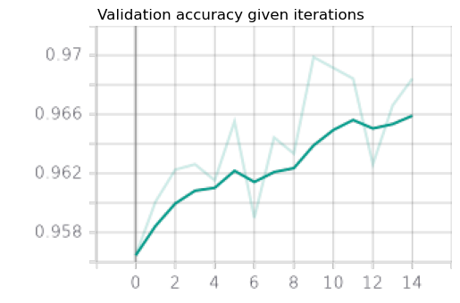
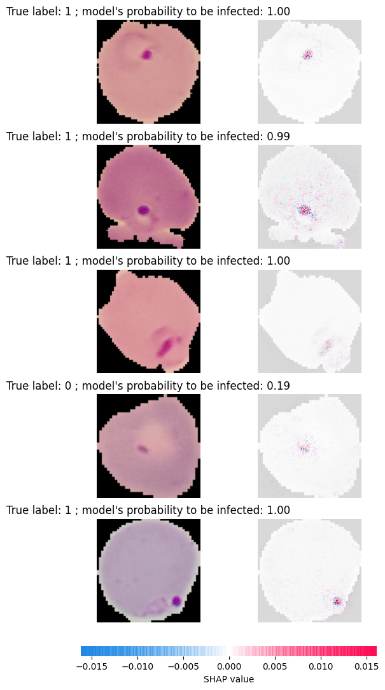

# Malaria detection using CNN

## Description 

This project aims at detecting parasitized (vs un-parasitized) cell images for the Malaria disease.
In order to do so, we use a custom implemented Convolutional Neural Network and some pre-trained models
(ResNet, VGG, AlexNet etc...).
Moreover, we explain each predictions using SHAP values ([Lundberg *et al.*, 2017](https://arxiv.org/pdf/1705.07874.pdf)).


## Project structure


```bash
.
├── data                         # Data folder                     
│   ├── 0                           # Un-infected cells
│   └── 1                           # Infected cells
├── models                       # Models to be trained
│   ├── __init__.py                 # Make models a Python package
│   ├── loss.py                     # Custom loss functions
│   ├── model.py                    # Model to train from scratch
│   ├── pretrained.py               # Pre-trained torchvision models
│   └── trainer.py                  # Class to perform training
├── reports                      # Reports related files
│   └── figures                     # Figures for Readme
├── saved                        # Folder to save different things during learning phase
│   ├── checkpoints                 # Checkpoints with model and optimizer states
│   ├── figures                     # Figures, mainly SHAP explanations
│   └── logs                        # TensorBoard logs
├── tests                        # Folder for unit testing
│   ├── __init__.py                 # Make tests a Python package
│   ├── test_dataset.py             # Unit testing for dataset 
│   ├── test_model.py               # Unit testing for model to train from scratch
│   ├── test_trainer.py             # Unit testing for Trainer class
│   └── test_utils.py               # Unit testing for utility functions
├── utils                        # Utility functions
│   ├── dataset.py                  # Dataset processing
│   ├── download_data.py            # Download locally images 
│   ├── __init__.py                 # Make utils a Python package
│   └── util.py                     # Other utility functions
├── visualization                # Visualization related modules
│   ├── explainer.py                # SHAP explainer class
│   ├── __init__.py                 # Make visualization a Python package
│   └── logger.py                   # TensorBoard logger
├── config.yaml                  # Configuration files (paths, hyper-parameters, ...)
├── main.py                      # Main file to train a model and explain it 
├── Makefile                     # Makefile with commands like make data or make train
├── README.md                    # Readme doc
└── requirements.txt             # Python packages requirements
```

## Installation


```bash
# clone project and make virtual environment
cd path/to/project
git clone https://github.com/Arnautt/CNN-Malaria-detection
cd CNN-Malaria-detection
make build-env
```


## Usage

First of all, you need to download data with the command :

```bash
make data
```

This will download official data in `./data`, containing two subfolders for infected and non-infected cells
as presented above.

To train models, you need to run the command :

```bash
make train
```

which will train a model and explain some predictions with SHAP values. All configuration parameters need
to be placed in *`config.py`*. All parameters purpose can be found in this configuration file.
Specifically, you can train a model from scratch or use a pre-trained model.

### Use of pre-trained models

To fine-tune a pre-trained model, you'll have to set **use_pretrained_model=True** and chose a model name between : 


- "alexnet", from the original article of [Krizhevsky *et al.*, 2012](https://papers.nips.cc/paper/2012/file/c399862d3b9d6b76c8436e924a68c45b-Paper.pdf).
- "vgg", from the original article of [Simonyan *et al.*, 2014](https://arxiv.org/pdf/1409.1556.pdf).
- "resnet", from the original article of [He *et al.*, 2015](https://arxiv.org/pdf/1512.03385.pdf).
- "squeezenet", from the original article of [Iandola *et al.*, 2016](https://arxiv.org/pdf/1602.07360.pdf).


You can then change all hyper-parameters for the optimizer, data augmentation, number of training iterations and so on.

### Train models from scratch


If you set **use_pretrained_model=True**, a model will be trained from scratch with hyper-parameters
from the configuration file. The architecture of this model includes some convolution blocks : 

Convolution → BatchNorm → Dropout → Relu → MaxPool

which form the features extraction part and some linear blocks : 

Linear → Dropout → Relu

which form the classifier part.


Each parameter can be modified in *config["model"]*. Especially, you can change the architecture
of the convolution blocks. Moreover, *n_out_channels* is a list with the number of output channels for each
convolutional block and *n_hidden_state* specifies the number of hidden units of the classifier part of the model.


## Results

Below, we can see a particular example of a ResNet trained during 15 epochs.
As the network is pre-trained, we achieve pretty good results even after 1 epoch.

<p align="center">
    
</p>


By repeating the experimentation, we found models with test accuracy around 97%.
Once the network is trained, analyze the results and in particular how the networks makes his predictions
is interesting. That's what we can do with the SHAP values. Below are particular cell images predictions
explained (probabilities are rounded by 2 decimals) : 


<p align="center">
    
</p>

and we're getting the results we could have expected. For parasitized images, it is the «stains» in the images that
most increase the likelihood of obtaining an infected cell.
